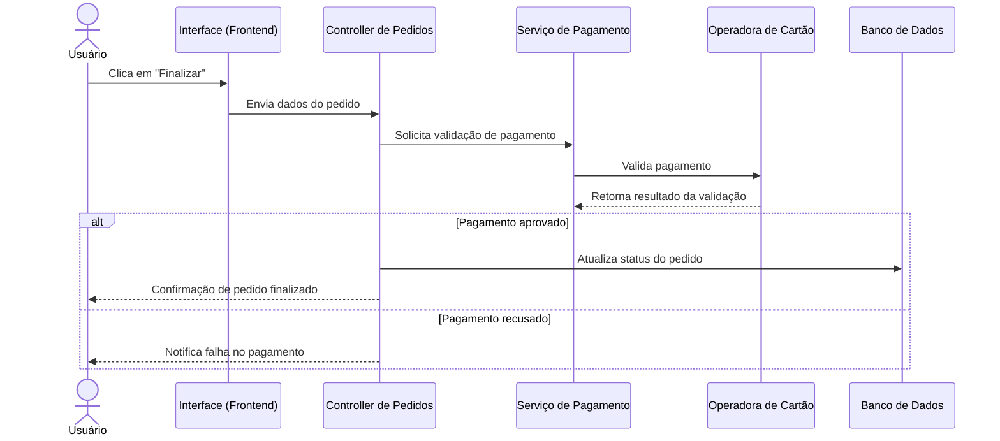
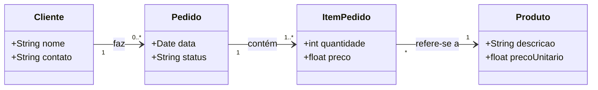

# Atividade semana 09

## PIM (Platform Independent Model)

- Larissa
- Erika
- Talita

## Diagrama de Sequencia



## Diagrama de classe


## Diagrama de Estado

```mermaid

stateDiagram-v2
    direction LR

  %%{init: {"config": {"layout": "elk"}}}%%
  [*] --> Pendente : carrinho fechado
  Pendente --> Pago : pagamento confirmado
  Pago --> Enviado : produto sai do estoque
  Enviado --> Entregue : entrega confirmada
  Pendente --> Cancelado : cancelamento
  Pago --> Cancelado : estorno
  Entregue --> [*]
  Cancelado --> [*]

  classDef normal stroke:#4ade80,fill:#f0fdf4
  classDef terminal stroke:#f87171,fill:#fef2f2
  class Pendente,Pago,Enviado normal
  class Entregue,Cancelado terminal

  ```

